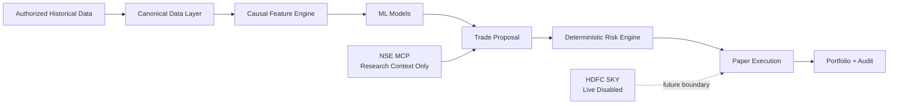

<div align="center">

# Trading Agent

### Research-first, risk-gated trading infrastructure for Indian markets


**Deterministic risk controls · Causal ML features · Walk-forward validation · NSE research context · Reproducible model registry**

</div>

> [!IMPORTANT]
> This repository is currently **paper-trading and research only**. Phase 4 model results are generated from synthetic fixtures and are **not evidence of expected profitability or live-market performance**.

## Why this project exists

The goal is to build an open-source trading-agent stack where AI/ML can propose ideas, but **cannot bypass deterministic risk controls**. Market research, model training, backtesting and execution are deliberately separated so that every boundary can be audited.



## Project status

| Phase | Milestone | Status |
| --- | --- | --- |
| **1** | Paper-trading foundation, API, PostgreSQL/Valkey, deterministic risk engine | ✅ Complete |
| **2** | Historical-data pipeline, causal features, transaction-cost model, backtesting | ✅ Complete |
| **3** | Official NSE MCP research integration with strict informational-only boundary | ✅ Complete |
| **4** | Leakage-safe ML training, model registry, holdout + rolling/expanding walk-forward evaluation | ✅ Complete |
| **5A** | Local grounding, fact guardrails, drift health, audited model lifecycle | ✅ Implemented on `phase5-grounding-drift` for review |
| **5B** | Licensed real NSE historical data and real-data validation | ⏭️ Next |

Tagged milestone: **`v0.4.0-phase4-model-training`**

## Phase 4 model snapshot

The synthetic Random Forest **direction** classifier achieved:

| Evaluation | Precision | Recall | F1 | Brier |
| --- | ---: | ---: | ---: | ---: |
| Holdout (85 samples) | 100.0% | **96.9%** | 98.4% | 0.0129 |
| Rolling fold 0 | 100.0% | **84.6%** | 91.7% | 0.0399 |
| Rolling fold 1 | 75.0% | **100.0%** | 85.7% | 0.1306 |
| Rolling fold 2 | 100.0% | **83.3%** | 90.9% | 0.0575 |

The rolling-window recall range is **83.3%–100%** (about **89.3% mean**).

> [!CAUTION]
> These are **synthetic engineering metrics**. There is no universal trading-industry recall threshold, and these values must not be interpreted as expected live-market accuracy. Read the [Phase 4 Model Card](docs/MODEL_CARD.md) for interpretation, limitations and the real-data acceptance framework.

## Core capabilities

- **Local grounding** — deterministic TF-IDF evidence packets, authoritative fact policy and explicit abstention.
- **Model reliability** — training-only drift baselines, latched quarantine and explicit audited champion/challenger promotion.
- **Risk-first execution** — deterministic policy checks remain authoritative.
- **Causal research pipeline** — features and labels enforce chronological boundaries and purging.
- **Walk-forward ML** — holdout, rolling and expanding-window evaluation without random shuffling.
- **Model registry** — versioned metadata, checksums, preprocessing state, Git commit and reproducibility information.
- **Backtesting** — configurable costs/slippage and risk-gated simulated execution.
- **NSE MCP boundary** — research context is isolated from training data and executable prices.
- **Paper API** — FastAPI endpoints for health, portfolio, positions, signals, risk, orders and audit.
- **Open-source runtime** — Python, uv, PostgreSQL, Valkey and rootless Podman.

## Quick start

```bash
uv sync --frozen
./scripts/check.sh
uv run python scripts/demo.py
```

Start the local stack:

```bash
podman compose up --build -d
curl http://127.0.0.1:8000/health
curl http://127.0.0.1:8000/ready
```

Run the complete Phase 4 synthetic experiment:

```bash
uv run python scripts/phase4_training.py --report PHASE4_MODEL_TRAINING_REPORT.md
```

Generated datasets, models, predictions and backtests are written under ignored `data/` paths. Model binaries are not committed.

## Safety architecture

The model never places an order directly:

```text
Prediction → Proposed Signal → Risk Engine → Execution Adapter → Portfolio
```

Current hard boundaries:

- live brokerage execution is disabled;
- HDFC SKY integration is a stub/boundary only;
- NSE MCP is informational only;
- NSE MCP data is not training eligible;
- synthetic model scores are not profitability claims;
- serialized models are loaded only from trusted local artifacts.

## Repository map

| Area | Documentation |
| --- | --- |
| Architecture | [docs/ARCHITECTURE.md](docs/ARCHITECTURE.md) |
| Grounding and fact policy | [docs/GROUNDING.md](docs/GROUNDING.md) |
| Model drift | [docs/MODEL_DRIFT.md](docs/MODEL_DRIFT.md) |
| Model lifecycle | [docs/MODEL_LIFECYCLE.md](docs/MODEL_LIFECYCLE.md) |
| Phase 5A reliability report | [PHASE5_RELIABILITY_REPORT.md](PHASE5_RELIABILITY_REPORT.md) |
| Risk engine | [docs/RISK_ENGINE.md](docs/RISK_ENGINE.md) |
| Data pipeline | [docs/DATA_PIPELINE.md](docs/DATA_PIPELINE.md) |
| Feature engineering | [docs/FEATURE_ENGINEERING.md](docs/FEATURE_ENGINEERING.md) |
| ML pipeline | [docs/ML_PIPELINE.md](docs/ML_PIPELINE.md) |
| **Model performance & recall** | **[docs/MODEL_CARD.md](docs/MODEL_CARD.md)** |
| ML evaluation conventions | [docs/ML_EVALUATION.md](docs/ML_EVALUATION.md) |
| Backtesting | [docs/BACKTESTING.md](docs/BACKTESTING.md) |
| Transaction costs | [docs/TRANSACTION_COSTS.md](docs/TRANSACTION_COSTS.md) |
| NSE MCP | [docs/NSE_MCP.md](docs/NSE_MCP.md) |
| HDFC SKY boundary | [docs/HDFC_SKY_INTEGRATION.md](docs/HDFC_SKY_INTEGRATION.md) |
| Security | [docs/SECURITY.md](docs/SECURITY.md) |
| Deployment | [docs/DEPLOYMENT.md](docs/DEPLOYMENT.md) |

Detailed Phase 4 experiment output: **[PHASE4_MODEL_TRAINING_REPORT.md](PHASE4_MODEL_TRAINING_REPORT.md)**

## Quality gates

Phase 5A validates:

- **325 passed**, 2 isolated-service tests skipped;
- **92% test coverage**;
- Ruff formatting/linting;
- strict mypy checks;
- package build verification;
- leakage and reproducibility regression tests.

## Roadmap

**Phase 5A: reliability implemented for review; next: Phase 5B licensed historical NSE data.**

Phase 5A adds local evidence retrieval, fail-closed fact policies, training-only
drift baselines, quarantine enforcement, decision provenance and explicit model
promotion. It has no mandatory cloud or LLM dependency and keeps paper-only execution.

```bash
uv run trading-agent grounding index --source docs --output data/grounding/index
uv run trading-agent grounding query "model limitations" --index data/grounding/index
uv run trading-agent model health MODEL --registry data/models
uv run trading-agent model drift MODEL --window window.json --trust-local-artifact
uv run trading-agent model audit --registry data/models
```

The next milestone is to replace synthetic engineering fixtures with authorized historical market data while preserving the same canonical ingestion, causal features, purged walk-forward evaluation, model registry and deterministic risk boundary.

Live brokerage execution remains out of scope until real-data evaluation and paper-trading validation are complete.

## License

Apache-2.0.
