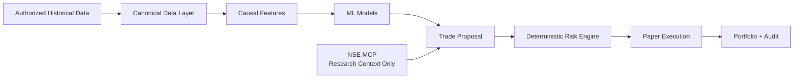

<div align="center">

# Trading Agent

### Research-first, risk-gated trading infrastructure for Indian markets


**Open-source research stack for market data, causal features, ML evaluation, deterministic risk controls and paper execution.**

</div>

> [!IMPORTANT]
> **Paper/research only.** No live brokerage execution is enabled. Phase 4 model metrics are synthetic engineering results, not evidence of expected profitability.

## Architecture



The key design principle is simple: **AI/ML can propose; the deterministic risk engine decides whether a simulated order is allowed.**

## Milestones

| Phase | Capability | Status |
| --- | --- | --- |
| **1** | Paper-trading foundation and deterministic risk engine | ✅ Complete |
| **2** | Historical-data pipeline, causal features and backtesting | ✅ Complete |
| **3** | Official NSE MCP research integration | ✅ Complete |
| **4** | Leakage-safe ML training and walk-forward evaluation | ✅ Complete — [tag](https://github.com/captain-jack-2002/trading-agent/releases/tag/v0.4.0-phase4-model-training) |
| **5** | Licensed real NSE historical data validation | ⏭️ Next |

Latest development branch: [`phase4-model-training`](https://github.com/captain-jack-2002/trading-agent/tree/phase4-model-training)

## Phase 4 research snapshot

The synthetic Random Forest direction classifier produced **96.9% recall on the 85-sample holdout**. Across the three rolling windows, recall ranged from **83.3% to 100%** (about **89.3% mean**).

These values are deliberately presented with context: **there is no universal trading-industry recall threshold**, and synthetic scores should not be projected into real-market accuracy.

Read the full **[Phase 4 Model Card](https://github.com/captain-jack-2002/trading-agent/blob/phase4-model-training/docs/MODEL_CARD.md)** for confusion matrices, precision/F1, calibration context, limitations and the planned real-data acceptance framework.

## What is already built

- deterministic, auditable risk gating;
- FastAPI paper-trading service;
- PostgreSQL + Valkey deployment stack;
- immutable/checksummed historical-data ingestion;
- causal technical and market features;
- chronological, purged train/validation/test splits;
- rolling and expanding walk-forward ML evaluation;
- Logistic Regression, Random Forest, LightGBM and Ridge baselines;
- local model registry with reproducibility metadata;
- configurable backtesting costs/slippage;
- NSE MCP research integration kept separate from training/execution;
- HDFC SKY integration boundary with live execution disabled.

## Quick start

```bash
uv sync --frozen
uv run python scripts/demo.py
./scripts/check.sh
```

Run the stack:

```bash
podman compose up --build -d
curl http://127.0.0.1:8000/health
curl http://127.0.0.1:8000/ready
```

## Documentation

| Topic | Link |
| --- | --- |
| Architecture | [docs/ARCHITECTURE.md](docs/ARCHITECTURE.md) |
| Risk controls | [docs/RISK_ENGINE.md](docs/RISK_ENGINE.md) |
| Historical data | [docs/DATA_PIPELINE.md](docs/DATA_PIPELINE.md) |
| Backtesting | [docs/BACKTESTING.md](docs/BACKTESTING.md) |
| NSE MCP boundary | [docs/NSE_MCP.md](docs/NSE_MCP.md) |
| Security | [docs/SECURITY.md](docs/SECURITY.md) |
| Deployment | [docs/DEPLOYMENT.md](docs/DEPLOYMENT.md) |
| **Phase 4 model performance** | **[Model Card](https://github.com/captain-jack-2002/trading-agent/blob/phase4-model-training/docs/MODEL_CARD.md)** |
| **Full Phase 4 report** | **[Training Report](https://github.com/captain-jack-2002/trading-agent/blob/v0.4.0-phase4-model-training/PHASE4_MODEL_TRAINING_REPORT.md)** |

## Next milestone

**Phase 5** will introduce licensed/authorized historical NSE data and rerun the same causal, leakage-controlled and risk-gated evaluation pipeline on real market history.

Until that validation is complete, the project remains strictly paper/research oriented.

## License

Apache-2.0.
