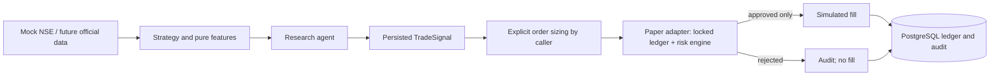
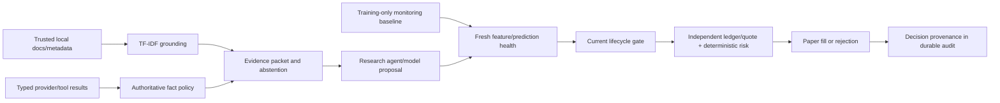

# Architecture

`models/domain.py` supplies immutable validated Pydantic contracts. Configuration
is immutable, environment-based and paper-only. Features do not import the agent.
The crossover strategy accepts a single instrument's ordered, closed bars; it
returns buy/sell only on a crossing and hold during warm-up or no crossing.
`ResearchAgent` composes context and portfolio information without access to an
execution adapter. `ResearchPipeline` persists bars, signals and a research audit
entry. Signal quantity and stop prices remain an explicit caller decision.

`BrokerExecutionAdapter.submit` is the sole order interface. `PaperBrokerAdapter`
loads the authoritative portfolio under a database lock, retrieves independent
provider quotes, evaluates all policies, applies an approved fill, and commits
all effects together. There is no public fill method accepting an approval flag.
`HDFCSkyAdapter.submit` unconditionally raises `NotImplementedError`.

## Storage

SQLAlchemy creates the initial schema on startup. Tables: `market_observations`,
`generated_signals`, `risk_decisions`, `orders`, `fills`, `positions`, `daily_pnl`,
`audit_events`, and the singleton `paper_ledger`. Domain payloads use JSONB on
PostgreSQL, storing Decimal as strings. IDs, timestamps, order uniqueness and
fill-to-order foreign keys are relational. Positions and daily P&L are materialized
with each portfolio transaction. A ledger snapshot supports restart restoration.

One PostgreSQL account-row lock serializes order decisions and ledger writes.
Rejected IDs are also consumed; retries cannot fill a previously rejected order.
Duplicate attempts produce risk and audit events without another order or fill.
There is no in-memory authority to diverge after a failed commit. File-backed SQLite uses
`BEGIN IMMEDIATE` and is covered as a test/development backend. Deploy one worker;
In-memory SQLite is rejected to avoid shared-connection rollback hazards;
initial schema creation is not a migration system for rolling multi-replica deploys.

Valkey caches disposable market context only. Connection errors fall back to a
bounded TTL memory cache. Neither cache carries duplicate IDs, approvals, cash or
positions. JSON logs emit selected structured fields without connection strings.

The offline CPU ML runtime lives in `ml/`, with causal reusable transformations
in `features/`. Grounding uses local scikit-learn; no LLM runtime is required.
Future broker transport must stay behind the same risk boundary and requires a
durable execution state machine for pending,
partial and uncertain fills before live use.

SQLAlchemy reference: [row-locking selects](https://docs.sqlalchemy.org/en/20/core/selectable.html#sqlalchemy.sql.expression.Select.with_for_update).

## Phase 5A reliability

`grounding/` exposes immutable contracts and a retriever protocol. Typed adapter
fact observations are bound to their exact source payload; source labels and
retrieval text never create execution authority. `ResearchAgent.ground` emits
cited packets, and `propose_grounded` holds when required evidence is unsupported.

`ModelPaperExecutor` independently loads a trusted model, snapshots features,
checks deployment chronology and fresh feature/prediction drift, and checks the
current registry lifecycle. Severe drift appends a latched quarantine event and
abstains before creating an order. The final lifecycle lock spans paper submission,
which obtains its own quote and locked ledger and always evaluates `RiskEngine`.
Feature freshness is rechecked inside the broker transaction after inference and
independent quote retrieval, so slow computation cannot authorize expired features.
Caller scores, prices, approvals and lifecycle flags are never accepted by the
public order interface. Manual order intent remains backward compatible.

Every paper order adds a compact `DecisionRecord` to its existing `paper_order`
audit event. Model attempts additionally emit `model_decision`; pre-order abstention
has no order/fill. Records retain dataset/feature versions, feature timestamp and feature/market hashes,
model UUID/version/binary and metadata digests, measured prediction, current health
and diagnostics reference, lifecycle event reference, evidence IDs/source hashes,
fact decisions/unsupported claims, proposal, risk and outcome. They retain no raw
retrieval text or connection settings. Fills, ledger changes and final provenance
commit in the same transaction.

The model registry keeps artifacts immutable and lifecycle transitions append-only.
Only explicit reviewed promotion changes the champion. Offline model backtests
also attach causal-window health to simulation orders; severe health rejects fills
alongside deterministic risk. Retrospective health does not mutate deployment state.
Pure offline predictors remain available for evaluation and cannot execute orders.

See [GROUNDING.md](GROUNDING.md), [MODEL_DRIFT.md](MODEL_DRIFT.md),
[MODEL_LIFECYCLE.md](MODEL_LIFECYCLE.md), and the
[Phase 5A report](../PHASE5_RELIABILITY_REPORT.md). HDFC SKY is disabled. NSE MCP
is informational-only, training-ineligible and executable-price-ineligible.
