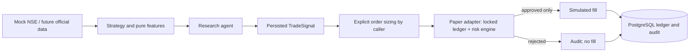

# Architecture

`models/domain.py` supplies immutable validated Pydantic contracts. Configuration
is immutable, environment-based and paper-only. Features do not import the agent.
The crossover strategy accepts a single instrument's ordered, closed bars; it
returns buy/sell only on a crossing and hold during warm-up or no crossing.
`ResearchAgent` composes context and portfolio information without access to an
execution adapter. `ResearchPipeline` persists bars, signals and a research audit
entry. Signal quantity and stop prices remain an explicit caller decision.

`BrokerExecutionAdapter.submit` is the sole order interface. `PaperBrokerAdapter`
loads the authoritative portfolio under a database lock, retrieves independent
provider quotes, evaluates all policies, applies an approved fill, and commits
all effects together. There is no public fill method accepting an approval flag.
`HDFCSkyAdapter.submit` unconditionally raises `NotImplementedError`.

## Storage

SQLAlchemy creates the initial schema on startup. Tables: `market_observations`,
`generated_signals`, `risk_decisions`, `orders`, `fills`, `positions`, `daily_pnl`,
`audit_events`, and the singleton `paper_ledger`. Domain payloads use JSONB on
PostgreSQL, storing Decimal as strings. IDs, timestamps, order uniqueness and
fill-to-order foreign keys are relational. Positions and daily P&L are materialized
with each portfolio transaction. A ledger snapshot supports restart restoration.

One PostgreSQL account-row lock serializes order decisions and ledger writes.
Rejected IDs are also consumed; retries cannot fill a previously rejected order.
Duplicate attempts produce risk and audit events without another order or fill.
There is no in-memory authority to diverge after a failed commit. File-backed SQLite uses
`BEGIN IMMEDIATE` and is covered as a test/development backend. Deploy one worker;
In-memory SQLite is rejected to avoid shared-connection rollback hazards;
initial schema creation is not a migration system for rolling multi-replica deploys.

Valkey caches disposable market context only. Connection errors fall back to a
bounded TTL memory cache. Neither cache carries duplicate IDs, approvals, cash or
positions. JSON logs emit selected structured fields without connection strings.

Future ML belongs in `models/` and reusable transformations in `features/`; no ML
or LLM runtime has been introduced. Future broker transport must stay behind the
same risk boundary and requires a durable execution state machine for pending,
partial and uncertain fills before live use.

SQLAlchemy reference: [row-locking selects](https://docs.sqlalchemy.org/en/20/core/selectable.html#sqlalchemy.sql.expression.Select.with_for_update).
